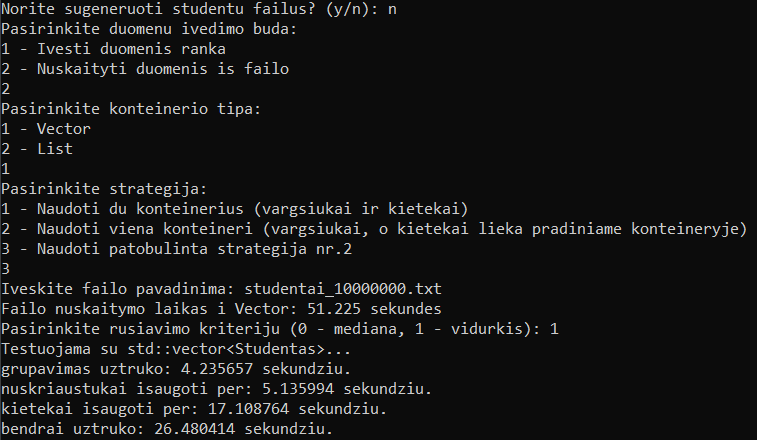

## v1.5

Šio leidimo pagrindinis tikslas – sukurti abstrakčią bazinę klasę Zmogus ir iš jos išvestinę klasę Studentas, laikantis objektinio programavimo principų. Programa yra pilnai funkcionali ir atitinka 1.5 versijos reikalavimus.

### 1. Abstrakti bazinė klasė Zmogus:

Apima bendras savybes ir metodus, susijusius su žmogumi (vardas, pavarde). Turi bent vieną grynai virtualią funkciją (printInfo), todėl yra abstrakti. Negali būti iškviečiama tiesiogiai – galima kurti tik išvestinių klasių objektus.

### 2. Išvestinė klasė Studentas:

Paveldi Zmogus savybes ir funkcijas, papildomai turi studento atributus:
- Namų darbų pažymiai (namuDarbai).
- Egzamino pažymys (egzaminas).
- Įgyvendina bazinės klasės metodą printInfo.

### 3. Pilnai veikianti programa:

- Leidžia įvesti studentų vardus, pavardes, namų darbų ir egzamino pažymius rankiniu būdu arba sugeneruoti juos atsitiktinai.
- Skaičiuoja galutinį pažymį pagal vidurkį ir medianą.

### 4. 1.2 versijos logikos palaikymas:

- Programa išlaiko 1.2 versijos metodų logiką: kopijavimo konstruktorius, kopijavimo priskyrimo operatorius ir destruktorius.

## v1.2

Tai yra patobulinta programa, kuri sukurta pagal praeitą versiją (version 1.1). Ši programa leidžia valdyti ir analizuoti studentų duomenis. Ji apima studentų vardo, pavardės, namų darbų pažymių ir egzamino pažymio įvedimą bei galutinio pažymio skaičiavimą. Programoje taikomi **perdengti metodai** (operatoriai), leidžiantys įvesti duomenis ir išvesti rezultatus tiek rankiniu, tiek automatiniu būdu, taip pat išsaugoti duomenis į failus.

## Perdengtų Metodų Aprašymas

Šiame projekte yra trys pagrindiniai metodai, kuriems buvo naudojami perdengti operatoriai (operator>> ir operator<<) duomenų įvedimui ir išvedimui. 

### 1. **Duomenų Įvesties Perdengti Metodai**

#### a. **Rankinis Įvedimas** *(Naudojant `operator>>`)*
Vartotojas gali rankiniu būdu įvesti studento vardą, pavardę, namų darbų pažymius ir egzamino pažymį.

**Pavyzdys**:

#### b. **Automatinis Įvedimas** *(Sugeneruota atsitiktinai per `operator>>`)*
Vartotojas pasirenka generuoti atsitiktinius pažymius. Programoje sugeneruojama atsitiktinė namų darbų pažymių seka ir įvedamas egzamino pažymys.

**Pavyzdys**:

#### c. **Įvedimas Iš Failo**
Programa gali nuskaityti studentų duomenis iš tekstinio failo, kuriame kiekvienas studentas yra pateikiamas atskiroje eilutėje. Failo formatas turi būti toks:

### 2. **Duomenų Išvedimo Perdengti Metodai**

#### a. **Išvestis Į Ekraną** *(Naudojant `operator<<`)*
Studentų duomenys išvedami į ekraną, naudojant formatuotą lentelę, kurioje pateikiama studento vardas, pavardė, galutinis vidurkis ir mediana.

**Pavyzdys**:

#### b. **Išvestis Į Failą**
Studentų rezultatai išsaugomi į failą, atskiriant juos į dvi grupes: kietekai ir nuskriaustukai. Kiekviena grupė yra išsaugoma atskirame faile (`kietekai___.txt`, `nuskriaustukai___.txt`).

**Failo Turinys** *(pvz., `kietekai_vec_vid.txt`)*:

## Lentelė: Perdengtų Metodų Apibendrinimas

| Metodas          | Paskirtis                                                                 | Pavyzdys                                                                 |
|------------------|---------------------------------------------------------------------------|--------------------------------------------------------------------------|
| `operator>>`     | Duomenų įvedimas rankiniu būdu arba automatinis generavimas.              | Įvedamas vardas, pavardė, pažymiai, egzaminas.                           |
| `operator<<`     | Duomenų išvestis į ekraną arba į failą formatuota lentele.                | Vardas, pavardė, vidurkis, mediana.                                      |
| Įvestis iš failo | Duomenys nuskaityti iš tekstinio failo (prireikus).                       | Nuskaitymas studento duomenų, atskirtų tarpais.                          |
| Išvestis į failą | Rezultatai išsaugomi skirtinguose failuose pagal galutinio pažymio ribas. | Studentai skirstomi į "kietekus" ir "nuskriaustukus".                    |

### Naudojimo instrukcija   
- **CMake**: Būtina turėti įdiegtą CMake (rekomenduojama versija 3.25 ar vėlesnė);
- **Kompiliatorius**: Tam, kad galėtumėte sukompiliuoti projektą, reikia turėti C++ kompiliatorių (pvz., GCC, MSVC).
- **Windows** (jei naudojate Windows): CMake ir `run.bat` failas buvo išbandyti Windows aplinkoje.
### Projekto struktūra
- **CMakeLists.txt**: Failas, naudojamas CMake projekto konfigūracijai ir kompilavimui.
- **run.bat**: Windows `.bat` failas, skirtas paleisti programą.
### Programos diegimas ir paleidimas
- **Klonuokite** šį projektą į savo vietinį kompiuterį;
- **Paleidimas** su run.bat - atliks visus reikalingus veiksmus: sukompiliuos projektą ir paleis jį automatiškai.

## v1.1
Tai yra patobulinta programa, kuri sukurta pagal praeitą versiją (version 1.0). v1.0 repozitorija buvo klonuota ir pagal ją sukurta šį versija.
Programoje duomenų tipas "Struct" yra pakeičiamas "Class" bei pakoreguotos funkcijos, kad jos veiktų su nauju duomenų tipu.

### Naudojimo instrukcija   
- **CMake**: Būtina turėti įdiegtą CMake (rekomenduojama versija 3.25 ar vėlesnė);
- **Kompiliatorius**: Tam, kad galėtumėte sukompiliuoti projektą, reikia turėti C++ kompiliatorių (pvz., GCC, MSVC).
- **Windows** (jei naudojate Windows): CMake ir `run.bat` failas buvo išbandyti Windows aplinkoje.
### Projekto struktūra
- **CMakeLists.txt**: Failas, naudojamas CMake projekto konfigūracijai ir kompilavimui.
- **run.bat**: Windows `.bat` failas, skirtas paleisti programą.
### Programos diegimas ir paleidimas
- **Klonuokite** šį projektą į savo vietinį kompiuterį;
- **Paleidimas** su run.bat - atliks visus reikalingus veiksmus: sukompiliuos projektą ir paleis jį automatiškai.

## Programų veikimo palyginimas su kompiliatoriaus optimizavimo vėliavėlėmis:

### Rezultatai:

### *Struct*:
| Optimizacijos lygis | Veikimo laikas (real)  | Failo dydis |
|---------------------|------------------------|-------------|
| `-O1`               | 0m12.623s              | 261KB       |
| `-O2`               | 0m12.597s              | 261KB       |
| `-O3`               | 0m11.118s              | 273KB       |

### *Class*:
| Optimizacijos lygis | Veikimo laikas (real)  | Failo dydis |
|---------------------|------------------------|-------------|
| `-O1`               | 0m11.582s              | 264KB       |
| `-O2`               | 0m9.721s               | 247KB       |
| `-O3`               | 0m9.360s               | 267KB       |

### *"Struct" - O2 veikimo laikas*:

### *"Class" - O2 veikimo laikas*:

### Išvados:
- **Veikimo laikas**: Kai optimizavimo lygis didėja, veikimo laikas sumažėja.
- **Failo dydis**: Kai didėja optimizavimo lygis, tai failo dydis taip pat didėja.
- **Duomenų tipo palyginimas**: Programa su 'Class' duomenų tipu veikia greičiau nei su 'Struct'.

## v1.0
### Naudojimo instrukcija   
- **CMake**: Būtina turėti įdiegtą CMake (rekomenduojama versija 3.25 ar vėlesnė);
- **Kompiliatorius**: Tam, kad galėtumėte sukompiliuoti projektą, reikia turėti C++ kompiliatorių (pvz., GCC, MSVC).
- **Windows** (jei naudojate Windows): CMake ir `run.bat` failas buvo išbandyti Windows aplinkoje.
### Projekto struktūra
- **CMakeLists.txt**: Failas, naudojamas CMake projekto konfigūracijai ir kompilavimui.
- **run.bat**: Windows `.bat` failas, skirtas paleisti programą.
### Programos diegimas ir paleidimas
- **Klonuokite** šį projektą į savo vietinį kompiuterį;
- **Paleidimas** su run.bat - atliks visus reikalingus veiksmus: sukompiliuos projektą ir paleis jį automatiškai.

### Programos veikimo greičio analizė pagal strategijas
Pirma strategija (1 str.) - studentų dalijimas studentų vektorių skirstant į du naujus vektorius - vargšiukai ir kietekai.  
Antra strategija (2 str.) - studentų dalijimas vargšiukus studentus įkeliant į naują vektorių ir juos ištrinant iš studentai vektoriaus.  
Trečia strategija (3 str.) - studentų dalijimas patobulinus antrą strategiją su "partition".
   
Strategijų lyginimas vector konteinerio atveju (laikai release versijai):
|Studentų skaičius|Programos dalis|1 str. laikas|2 str. laikas|3 str. laikas| 
|---|---|---|---|---|
|1000|Duomenų nuskaitymas|0.011 s|0.008 s|0.008 s|
||Dalijimas į grupes|0.001 s|0.000 s|0.000 s|
||Įrašymas į nuskriaustukai|0.001 s|0.002 s|0.002 s|
||Įrašymas į kietekai|0.002 s|0.003 s|0.003 s|
|10000|Duomenų nuskaitymas|0.075 s|0.056 s|0.058 s|
||Dalijimas į grupes|0.004 s|0.001 s|0.001 s|
||Įrašymas į nuskriaustukai|0.019 s|0.008 s|0.008 s|
||Įrašymas į kietekai|0.018 s|0.018 s|0.019 s|
|100000|Duomenų nuskaitymas|0.536 s|0.516 s|0.517 s|
||Dalijimas į grupes|0.043 s|0.007 s|0.006 s|
||Įrašymas į nuskriaustukai|0.052 s|0.051 s|0.052 s|
||Įrašymas į kietekai|0.173 s|0.169 s|0.172 s|
|1000000|Duomenų nuskaitymas|5.10 s|5.09 s|5.07 s|
||Dalijimas į grupes|0.48 s|0.08 s|0.07 s|
||Įrašymas į nuskriaustukai|0.53 s|0.51 s|0.51 s|
||Įrašymas į kietekai|1.81 s|1.74 s|1.71 s|
|10000000|Duomenų nuskaitymas|52.56 s|51.38 s|51.23 s|
||Dalijimas į grupes|31.87 s|3.62 s|4.24 s|
||Įrašymas į nuskriaustukai|5.15 s|5.13 s|5.14 s|
||Įrašymas į kietekai|17.87 s|17.21 s|17.11 s|

Strategijų lyginimas list konteinerio atveju (laikai release versijai):  
|Studentų skaičius|Programos dalis|1 str. laikas|2 str. laikas|3 str. laikas| 
|---|---|---|---|---|
|1000|Duomenų nuskaitymas|0.008 s|0.008 s|0.008 s|
||Dalijimas į grupes|0.001 s|0.000 s|0.000 s|
||Įrašymas į nuskriaustukai|0.004 s|0.002 s|0.002 s|
||Įrašymas į kietekai|0.035 s|0.003 s|0.003 s|
|10000|Duomenų nuskaitymas|0.056 s|0.056 s|0.055 s|
||Dalijimas į grupes|0.006 s|0.001 s|0.000 s|
||Įrašymas į nuskriaustukai|0.018 s|0.008 s|0.008 s|
||Įrašymas į kietekai|0.018 s|0.018 s|0.018 s|
|100000|Duomenų nuskaitymas|0.507 s|0.510 s|0.507 s|
||Dalijimas į grupes|0.092 s|0.006 s|0.007 s|
||Įrašymas į nuskriaustukai|0.051 s|0.052 s|0.052 s|
||Įrašymas į kietekai|0.164 s|0.176 s|0.178 s|
|1000000|Duomenų nuskaitymas|5.09 s|5.06 s|5.08 s|
||Dalijimas į grupes|1.37 s|0.07 s|0.07 s|
||Įrašymas į nuskriaustukai|0.50 s|0.51 s|0.51 s|
||Įrašymas į kietekai|1.67 s|1.76 s|1.78 s|
|10000000|Duomenų nuskaitymas|50.60 s|50.56 s|50.45 s|
||Dalijimas į grupes|21.63 s|5.09 s|6.43 s|
||Įrašymas į nuskriaustukai|7.42 s|5.07 s|5.07 s|
||Įrašymas į kietekai|16.48 s|17.77 s|17.90 s|

## v0.3

Tai yra patobulinta programa, kuri sukurta pagal praeitą versiją (version 0.2). Programa skaito studentų informaciją iš failų, suskaido juos į grupes pagal jų pažymius, ir saugo surūšiuotus studentus atskiruose failuose. This version includes enhanced performance measurement for various containers (e.g., `std::vector`, `std::list`).

## Sistemos parametrai

- **CPU**: AMD Ryzen 5 5500U, 2.10 GHz
- **RAM**: 8.00 GB
- **HDD**:
  - Tipas: SSD
  - Talpa: 237 GB

## Savybės

- **Nuskaitymas**: Studentų duomenų nuskaitymas iš failų.
- **Grupavimas**: Studentų grupavimas į `nuskriaustukai` (studentai, kurių galutinis balas yra mažiau už 5) ir `kietekai` (studentai, kurių galutinis balas yra 5 arba daugiau).
- **Išvedimas**: Grupių išsaugojimas į atskirus tekstinius failus.
- **Laikas**: Laiko matavimas atliekant skaičiavimus su skirtingais konteineriais (`std::vector` ir `std::list`).

## Testavimas ir rezultatai

Programos testavimo rezultatai:

| Failo dydis | Konteinerio tipas | Skaitymo laikas (s) | Grupavimo laikas (s) | nuskriaustukai laikas (s) | kietekai laikas (s)  | Bendras laikas (s) |
|-------------|-------------------|---------------------|----------------------|---------------------------|----------------------|--------------------|
| 1,000       | std::vector       | 0.012               | 0.025                | 0.015                     | 0.016                | 0.056              |
| 10,000      | std::vector       | 0.128               | 0.113                | 0.119                     | 0.117                | 0.354              |
| 100,000     | std::vector       | 1.115               | 1.166                | 1.184                     | 1.135                | 3.358              |
| 1,000,000   | std::vector       | 11.059              | 11.003               | 11.408                    | 11.304               | 33.685             |
| 10,000,000  | std::vector       | 122.310             | 122.438              | 108.914                   | 107.627              | 338.955            |
| 1,000       | std::list         | 0.011               | 0.018                | 0.014                     | 0.028                | 0.060              |
| 10,000      | std::list         | 0.113               | 0.123                | 0.115                     | 0.116                | 0.354              |
| 100,000     | std::list         | 1.166               | 1.121                | 1.147                     | 1.090                | 3.358              |
| 1,000,000   | std::list         | 11.442              | 11.532               | 11.369                    | 11.226               | 34.127             |
| 10,000,000  | std::list         | 116.887             | 124.180              | 107.284                   | 107.492              | 338.955            |

## Pasikeitimai nuo v0.2
   
1. **Konteinerių tipai**: Programa palaiko skirtingus konteinerių tipus (`std::vector`, `std::list`). Tai leidžia palyginti konteinerių panaudojimą.
   
2. **Padidintas saugojimo failų skaičius**: Programa išveda 4 tekstinius failus: 2 grupės su vektoriumi, 2 grupės su sąrašu.

3. **Saugojimo atmintyje adresas**: Pasirinkus įvesti duomenis rankiniu būdu, yra išvedamas saugojimo atmintyje adresas.

